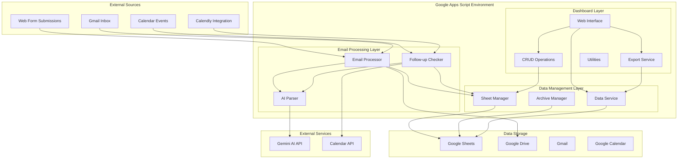
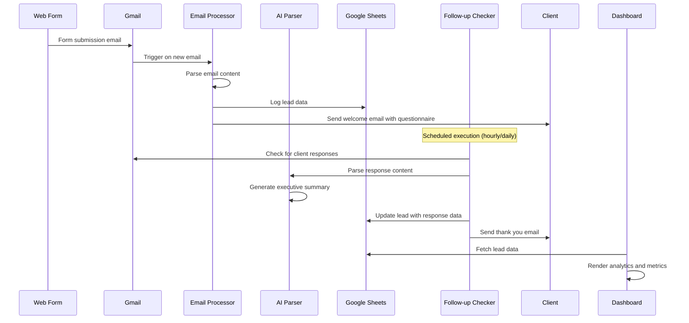

# Email Automation System - Architecture Documentation

## Overview

This Google Apps Script project is an enterprise-grade email automation and lead management system designed for law firms. It provides automated email processing, intelligent questionnaire handling, follow-up management, and a comprehensive dashboard for lead tracking and analytics.

## Table of Contents

1. [System Architecture](#system-architecture)
2. [Module Structure](#module-structure)
3. [Data Flow](#data-flow)
4. [Core Components](#core-components)
5. [Integration Points](#integration-points)
6. [Configuration Management](#configuration-management)
7. [Security & Authentication](#security--authentication)
8. [Deployment & Operations](#deployment--operations)
9. [Troubleshooting Guide](#troubleshooting-guide)

## System Architecture



## Module Structure

### Email Processing Module (`email-processing/`)

#### `emailProcessor.gs`
**Purpose**: Main entry point for processing incoming lead emails from web forms.

**Key Functions**:
- `processLeadEmails()`: Main function that processes unread emails with subject "New submission - Law Firm Contact Form"
- `testEmailParsing()`: Test function for validating email parsing with different formats
- `getConfigValue(key)`: Retrieves configuration values from Script Properties

**Email Parsing Strategies** (in order of precedence):
1. **Original Format**: `key: value` pairs
2. **Formspark Format**: Capitalized field names with colons
3. **JSON Format**: Embedded JSON content
4. **Simple Format**: Space-separated key-value pairs

**Configuration Variables**:
- `CALENDLY_LINK`: Scheduling link for consultations
- `LEAD_TRACKER_SHEET_ID`: Google Sheet ID for lead storage
- `YOUR_EMAIL`: Firm's email address
- `FOLDER_ID`: Google Drive folder ID for questionnaires

**Questionnaire File Mapping**:
```javascript
{
  'Probate': 'probate.txt',
  'Small Business': 'small_business.txt',
  'Estate Planning': 'estate_planning.txt',
  'Traffic/Criminal': 'traffic_criminal.txt'
}
```

#### `followUpChecker.gs`
**Purpose**: Automated follow-up detection and reminder system with AI-powered response processing.

**Key Functions**:
- `checkFollowUps()`: Main function that processes all leads for follow-up actions
- Detects client responses through multiple methods
- Generates AI-powered executive summaries
- Sends targeted reminders based on completion status

**Follow-up Detection Methods**:
1. Calendar API integration for appointment detection
2. Gmail search for reply detection
3. ICS attachment parsing for calendar invites
4. Calendly webhook integration

**AI Integration**:
- Uses Gemini AI API for response parsing and summarization
- Fallback to regex-based parsing when AI unavailable
- Intelligent client name extraction from multiple sources

#### `aiParser.gs`
**Purpose**: AI-powered text parsing and executive summary generation.

**Key Functions**:
- `generateExecutiveSummary(emailContent, clientName)`: Creates AI-powered summaries
- `parseReplyWithAI(text)`: Extracts structured data from client responses
- `parseReplyWithRegex(text, appointmentTypesList)`: Fallback regex parsing
- `extractClientName(parsed, sheetName, replyContent, emailAddr)`: Smart name extraction
- `buildSummaryFromParsed(parsed)`: Creates summaries from parsed data

**AI Features**:
- Retry logic with exponential backoff
- Context-aware legal terminology understanding
- Multi-source name extraction
- Quality assurance validation

#### `sheetManager.gs`
**Purpose**: Centralized Google Sheets operations for lead data management.

**Key Functions**:
- `markQuestionnaireResponse(email, parsedAtIso, parsedObj, cleanedText, executiveSummary, matchMethod)`: Records questionnaire responses
- `recordCalendarInvite(email, scheduledAtIso, calendarEventId)`: Logs calendar appointments

**Data Integrity Features**:
- Atomic operations with locking
- Column existence validation
- Error handling and rollback
- Duplicate prevention

#### `archiveManager.gs`
**Purpose**: Lead lifecycle management including archiving and cleanup.

**Key Functions**:
- `deleteLead(email)`: Safely archives and removes leads
- `archiveLeadsOlderThan(days)`: Bulk archiving of old leads
- `purgeArchivedOlderThan(days)`: Cleanup of archived data
- `getArchiveInfo()`: System information for archival operations

**Archival Features**:
- Safe deletion with backup to Archive sheet
- Timestamp tracking for archival operations
- Automated cleanup scheduling
- Data retention compliance

### Dashboard Module (`dashboard/`)

#### `webInterface.gs`
**Purpose**: Web application serving and HTML template management.

**Key Functions**:
- `doGet()`: Serves the main dashboard HTML page
- `include(filename)`: Template inclusion system for modular HTML

**Web App Configuration**:
- Anonymous access enabled
- Cross-frame compatibility
- Mobile-responsive viewport
- Proper favicon and metadata

#### `dataService.gs`
**Purpose**: Comprehensive data retrieval and analytics for the dashboard.

**Key Functions**:
- `getLeads()`: Retrieves all leads with enhanced data processing
- `getMetrics()`: Calculates KPIs and performance metrics
- `getSystemInfo()`: Returns system status and configuration

**Data Processing Features**:
- ISO timestamp normalization
- Completion status calculation
- Response rate analytics
- Lead volume tracking

#### `crudOperations.gs`
**Purpose**: Create, Read, Update, Delete operations for lead management.

**Key Functions**:
- `deleteLead(email)`: Removes lead by email address
- `updateLeadFollowUpStatus(email, followedUp)`: Updates follow-up status
- `bulkUpdateFollowUpStatus(emails)`: Batch status updates
- `getQuestionnaire(fileName)`: Retrieves questionnaire content

**CRUD Features**:
- Bulk operations support
- Error handling and validation
- Audit trail maintenance
- Referential integrity

#### `exportService.gs`
**Purpose**: Data export functionality with filtering capabilities.

**Key Functions**:
- `exportLeadsAsCSV(filterCriteria)`: Exports filtered data as CSV
- `escapeCSV(value)`: Proper CSV formatting
- `applyFiltersToLeads(leads, filters)`: Filter application logic

**Export Features**:
- Multiple format support
- Advanced filtering
- Data sanitization
- Proper encoding

#### `utils.gs`
**Purpose**: Shared utility functions for dashboard operations.

**Key Functions**:
- `determineLeadStatus(lead)`: Status calculation logic
- `getCompletionStatus(hasResponded, hasScheduled)`: Completion tracking
- `sendEmailNotification(to, subject, body)`: Email notification system
- `testSetup()`: System health verification

### Frontend (`Index.html`)

**Architecture**: Single-page application with modular JavaScript components.

**Key Features**:
- Bootstrap 5 for responsive design
- DataTables for advanced grid functionality
- Custom charting library for Google Apps Script compatibility
- Real-time dashboard updates
- Advanced filtering and search
- Bulk operation support

**Charts and Analytics**:
- Lead volume trends
- Service type distribution
- Response rate analysis
- Performance metrics

## Data Flow



## Core Components

### Configuration System

**Script Properties** (managed via Google Apps Script interface):
```javascript
{
  'CALENDLY_LINK': 'https://calendly.com/...',
  'LEAD_TRACKER_SHEET_ID': '1tqjF1eUxzF3Hk...',
  'YOUR_EMAIL': 'contact@harborviewlegal.com',
  'FOLDER_ID': '1GGrFx626jIuBgCe...',
  'AI_API_KEY': 'AIzaSyC...',
  'ENABLE_AI_SUMMARY': 'true'
}
```

### Google Sheets Schema

**Leads Sheet Structure**:
| Column | Field | Type | Description |
|--------|-------|------|-------------|
| A | Email | String | Lead's email address (primary key) |
| B | Name | String | Lead's full name |
| C | Phone | String | Contact phone number |
| D | Preferred Day | String | Preferred consultation day |
| E | Preferred Time | String | Preferred consultation time |
| F | Appointment Types | String | Services requested (comma-separated) |
| G | Message | String | Original inquiry message |
| H | Timestamp | DateTime | When lead was received |
| I | Followed Up | Boolean | Follow-up status |
| J | ReminderSentAt | DateTime | When reminder was sent |
| K | ThreadId | String | Gmail thread ID |
| L | EventId | String | Calendar event ID |
| M | MatchMethod | String | How response was detected |
| N | ResponseReceived | Boolean | Whether client responded |
| O | ExecutiveSummary | String | AI-generated summary |
| P | QuestionnaireResponses | String | Raw questionnaire responses |
| Q | QuestionnaireParsed | String | Structured parsed responses |
| R | CalendarScheduledAt | DateTime | When appointment is scheduled |
| S | CalendarEventId | String | Calendar event identifier |

### Error Handling Strategy

**Three-Tier Error Handling**:
1. **Function Level**: Try-catch blocks with specific error logging
2. **Module Level**: Graceful degradation and fallback mechanisms
3. **System Level**: Notification and monitoring systems

**Locking Strategy**:
- Script-level locks for concurrent execution prevention
- Timeout handling with exponential backoff
- Lock release in finally blocks

## Integration Points

### External Services

#### Gemini AI API
- **Purpose**: Natural language processing and summarization
- **Authentication**: API key via Script Properties
- **Rate Limiting**: Exponential backoff retry logic
- **Fallback**: Regex-based parsing when unavailable

#### Google Calendar API
- **Purpose**: Appointment detection and scheduling
- **Authentication**: OAuth 2.0 (automatic in Google Apps Script)
- **Scope**: Calendar read/write access
- **Features**: Event creation, modification, and parsing

#### Calendly Integration
- **Purpose**: External scheduling system integration
- **Method**: ICS attachment parsing and webhook detection
- **Data**: Event details and scheduling information

### Internal Google Services

#### Gmail API
- **Search Functionality**: Advanced query building for response detection
- **Label Management**: Automated organization with "Processed" labels
- **Email Sending**: Automated welcome emails and reminders

#### Google Drive API
- **Questionnaire Storage**: Text files for different legal practice areas
- **File Management**: Dynamic questionnaire content retrieval
- **Access Control**: Folder-based permissions

## Configuration Management

### Environment Setup

**Required Script Properties**:
```javascript
// Core Configuration
CALENDLY_LINK: "https://calendly.com/your-calendar"
LEAD_TRACKER_SHEET_ID: "your-google-sheet-id"
YOUR_EMAIL: "your-firm-email@domain.com"
FOLDER_ID: "your-google-drive-folder-id"

// AI Features (Optional)
AI_API_KEY: "your-gemini-api-key"
ENABLE_AI_SUMMARY: "true"
```

**Advanced Services Required**:
- People API v1
- Calendar API v3

**OAuth Scopes** (automatically handled):
- Gmail read/write
- Sheets read/write
- Drive read
- Calendar read/write

### Questionnaire Configuration

**File Structure** in Google Drive folder:
```
questionnaires/
├── probate.txt
├── small_business.txt
├── estate_planning.txt
└── traffic_criminal.txt
```

## Security & Authentication

### Access Control

**Web App Security**:
- Execute as: User deploying the script
- Access: Anyone (anonymous) - for public dashboard
- HTTPS enforced
- XFrame options configured

**API Security**:
- Script Properties for sensitive configuration
- No hardcoded credentials
- Proper error message sanitization

### Data Privacy

**PII Handling**:
- Minimal data collection
- Secure storage in Google infrastructure
- Automated archiving and cleanup
- No third-party data sharing

**Audit Trail**:
- All operations logged with timestamps
- Email processing history
- Response tracking and attribution

## Deployment & Operations

### Deployment Process

**Prerequisites**:
1. Google Apps Script project created
2. Required Advanced Services enabled
3. Script Properties configured
4. Google Sheet and Drive folder created
5. Web app deployed with proper permissions

**Deployment Steps**:
```bash
# Using clasp CLI tool
clasp login
clasp create --type webapp
clasp push
clasp deploy
```

### Monitoring & Maintenance

**Automated Triggers**:
```javascript
// Email processing trigger
ScriptApp.newTrigger('processLeadEmails')
  .timeBased()
  .everyMinutes(15)
  .create();

// Follow-up checker trigger
ScriptApp.newTrigger('checkFollowUps')
  .timeBased()
  .everyHours(1)
  .create();

// Archive cleanup trigger
ScriptApp.newTrigger('scheduledArchiveLeadsOlderThan30')
  .timeBased()
  .onWeekDay(ScriptApp.WeekDay.SUNDAY)
  .atHour(2)
  .create();
```

**Performance Monitoring**:
- Script execution time tracking
- Error rate monitoring
- API quota usage
- Storage utilization

### Backup & Recovery

**Data Backup Strategy**:
1. Google Sheets automatic version history
2. Archive sheet for deleted leads
3. Drive folder backup for questionnaires
4. Script code version control

**Recovery Procedures**:
1. Lead data recovery from Archive sheet
2. Configuration restoration from backup
3. Trigger recreation after failures
4. Permission reset procedures

## Troubleshooting Guide

### Common Issues

#### Email Processing Problems

**Symptom**: Emails not being processed
**Diagnosis**:
1. Check Gmail search query: `subject:"New submission - Law Firm Contact Form" is:unread`
2. Verify trigger is active and executing
3. Check Script Properties configuration
4. Review execution transcript logs

**Solution**:
```javascript
// Test email processing manually
function testEmailProcessing() {
  console.log('Testing email processing...');
  processLeadEmails();
}
```

#### AI Summary Failures

**Symptom**: "Summary unavailable" messages
**Diagnosis**:
1. Verify `AI_API_KEY` in Script Properties
2. Check `ENABLE_AI_SUMMARY` setting
3. Review API quota usage
4. Test API connectivity

**Solution**:
```javascript
// Test AI functionality
function testAI() {
  var summary = generateExecutiveSummary("Test content", "Test Client");
  console.log('AI Summary result:', summary);
}
```

#### Sheet Access Errors

**Symptom**: "Leads sheet not found" errors
**Diagnosis**:
1. Verify `LEAD_TRACKER_SHEET_ID` is correct
2. Check sheet permissions
3. Ensure "Leads" sheet tab exists
4. Verify proper column headers

**Solution**:
```javascript
// Verify sheet access
function testSheetAccess() {
  var ss = SpreadsheetApp.openById(LEAD_TRACKER_SHEET_ID);
  var sheet = ss.getSheetByName('Leads');
  console.log('Sheet found:', sheet.getName());
}
```

### Performance Optimization

**Execution Time Limits**:
- 6-minute maximum execution time
- Batch processing for large datasets
- Chunked operations for heavy workloads
- Proper error handling and continuation

**Memory Management**:
- Efficient data structures
- Garbage collection considerations
- Large dataset pagination
- Resource cleanup in finally blocks

### Maintenance Tasks

#### Weekly Tasks
1. Review execution logs for errors
2. Monitor AI API usage and costs
3. Check lead processing statistics
4. Verify backup systems

#### Monthly Tasks
1. Archive old leads (automated)
2. Review and update questionnaire content
3. Performance metrics analysis
4. Security audit and updates

#### Quarterly Tasks
1. Comprehensive system testing
2. Configuration backup and documentation
3. User access review
4. Scalability assessment

---

## Contact & Support

For technical support or questions about this architecture:
- Review execution logs in Google Apps Script console
- Check Script Properties configuration
- Verify trigger status and execution history
- Test individual components using provided test functions

This documentation serves as a comprehensive guide for understanding, maintaining, and extending the email automation system. Regular updates to this document should reflect any system changes or enhancements.