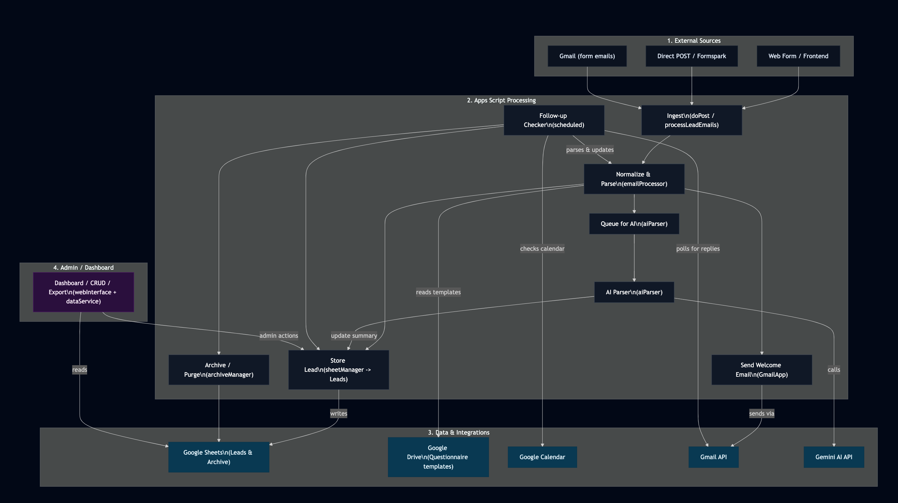

# Email Automation — Architecture (Developer Draft)

## Overview
A Google Apps Script project that accepts lead submissions (POST and form-email), sends welcome/reminder/thank-you emails, records leads in a Google Sheet, detects follow-ups (Gmail/Calendar/ICS), generates executive summaries via Gemini AI (optional), and exposes a dashboard web UI.

Primary folders:
- `google_apps_scripts/email-processing` — core ingestion, parsing, follow-up, sheet & archive management, AI.
- `google_apps_scripts/dashboard` — dashboard endpoints, CRUD, export.
- `google_apps_scripts/tests*` / `TESTING.md` — test runners and docs.
- `Index.html` — dashboard UI template.

This document is the canonical developer-facing architecture reference for the Apps Script project.

---

## Architecture Diagram



---

## Public entry points & scheduled helpers
- `doPost(e)` — HTTP endpoint for direct POST submissions (rate-limited); returns JSON.
- `doGet(e)` / `doOptions(e)` — Web UI / CORS handlers.
- `processLeadEmails()` — batch processor for unread form-submission emails (email ingestion path).
- `checkFollowUps()` — scheduled follow-up detection and reminders (Gmail, Calendar, ICS).
- `scheduledArchiveLeadsOlderThan30()` — helper for scheduled bulk archiving.
- `scheduledPurgeArchivedOlderThan30()` — helper for scheduled purge of old archive rows.
- Test entry points: `quickTestRunner`, `runAllTests`, `manualTestRunner`, and various `test*` helpers in `tests.gs`.

---

## Module map and responsibilities

- email-processing/emailProcessor.gs
  - Parse incoming emails (supports multiple formats), send welcome emails, build questionnaire content from Drive templates, append to Leads sheet, mark threads/read, label processed.
  - Implements rate-limiting via `_checkRateLimit(maxCount, windowMs)` and POST handling (`doPost`).
- email-processing/aiParser.gs
  - `generateExecutiveSummary()`, `parseReplyWithAI()`, `parseReplyWithRegex()`, `extractClientName()`, `buildSummaryFromParsed()`.
  - Calls Gemini (Generative Language API) via `UrlFetchApp` with retry/backoff; falls back to regex parser.
- email-processing/followUpChecker.gs
  - `checkFollowUps()`: searches Gmail for replies, checks Calendar events, parses ICS attachments, runs parsing (AI or regex), writes parsed results via `markQuestionnaireResponse()`, sends thank-you and reminder emails.
  - Uses `LockService` to prevent concurrent runs.
- email-processing/sheetManager.gs
  - `markQuestionnaireResponse(email, ...)`, `recordCalendarInvite(email, ...)`.
  - Handles header extension, locking, idempotent updates, and JSON persistence of parsed questionnaire fields.
- email-processing/archiveManager.gs
  - `deleteLead(email)`, `archiveLeadsOlderThan(days)`, `purgeArchivedOlderThan(days)`, `createArchiveIfMissing()`, `getArchiveInfo()`.
- email-processing/utils.gs
  - Shared helpers (parsing support, small utilities).
- dashboard/webInterface.gs
  - `doGet()` serves `Index.html` template; `include(filename)` helper.
- dashboard/dataService.gs
  - `getLeads()`, `getMetrics()`, `getAnalyticsData()`, `getSystemInfo()` — canonical lead normalization and computed KPIs.
- dashboard/crudOperations.gs
  - `deleteLead(email)`, `updateLeadFollowUpStatus(email, followedUp)`, `bulkUpdateFollowUpStatus(emails)`, `getQuestionnaire(fileName)`.
- dashboard/exportService.gs
  - `exportLeadsAsCSV(filterCriteria)`, `escapeCSV()`, `applyFiltersToLeads()`.
- tests.gs / TESTING.md
  - Unit/integration helpers and docs (runAllTests, manualTestRunner, runComprehensiveTests).

---

## Canonical "Leads" sheet schema (1-based indices where possible)
Derived from `doPost`, `emailProcessor`, `sheetManager` and `dataService`. The scripts ensure headers exist and will append missing header columns when necessary; nevertheless maintain canonical headers in production.

Header row (exact header names used by code; recommended canonical order):
1. Email (A) — string — primary lookup key
2. Name (B)
3. Phone (C)
4. Preferred Day (D)
5. Preferred Time (E)
6. Appointment Types (F) — comma-separated string
7. Message (G) — original inquiry
8. Timestamp (H) — Date when lead was recorded
9. Followed Up (I) — boolean
10. ReminderSentAt (J) — Date
11. ThreadId (K) — Gmail thread id (string)
12. EventId (L) — Calendar event id (string)
13. MatchMethod (M) — detection source (e.g., `gmail_reply`, `calendar_api`, `ics_attachment`)
14. ResponseReceived (N) — boolean (true when questionnaire response recorded)
15. ExecutiveSummary (O) — string (AI or fallback summary)
16. QuestionnaireResponses (P) — cleaned plain-text stored reply
17. QuestionnaireParsed (Q) — JSON string of parsed answers
18+. CalendarScheduledAt, CalendarEventId, Source, etc. — added dynamically by code when required

Sample CSV-style example row:
"alice@example.com","Alice Example","512-555-1212","Tuesday","Morning","Estate Planning","I need a trust","2025-01-01T12:00:00Z",false, , "THREADID123", , "gmail_reply", true, "Important points: ...", "Q1: Yes\nQ2: No", "{}"

---

## Runtime behavior & recommended triggers
Recommended schedule (create via Apps Script UI or with ScriptApp triggers):
- `processLeadEmails()` — every 15 minutes (ingest unread form emails).
- `checkFollowUps()` — every hour (detect replies, appointments, and send reminders).
- `scheduledArchiveLeadsOlderThan30()` — weekly (e.g., Sunday 02:00) or monthly per retention policy.
- `scheduledPurgeArchivedOlderThan30()` — monthly or per retention policy.

Web app behavior:
- `doPost(e)` handles external POSTs; the project’s `appsscript.json` config shows:
  - `executeAs: USER_DEPLOYING`
  - `access: ANYONE_ANONYMOUS`
- Rate limiting: `_checkRateLimit(300, 60*60*1000)` in `doPost` — default max 300 submissions per hour (global).
- Concurrency: `LockService` used in follow-up and sheet writes. Scripts release locks in finally/cleanup paths when possible.
- Web app routing: `doGet` now acts as a router. API-style requests can opt-in to JSON responses using `?api=1` or `?format=json`. All other GET requests serve the HTML dashboard (`Index.html`). This preserves the existing POST API while allowing the dashboard to be loaded at the same webapp URL.

---

## Integrations, required configuration & secrets

Script Properties keys (observed and required by code):
- `CALENDLY_LINK` — scheduling URL shown to leads
- `LEAD_TRACKER_SHEET_ID` — Google Sheet ID used by the project
- `YOUR_EMAIL` — firm/admin email for reply-to and admin notifications
- `FOLDER_ID` — Drive folder containing questionnaire templates
- `AI_API_KEY` — Gemini / Generative Language key (optional if `ENABLE_AI_SUMMARY` is `'true'`)
- `ENABLE_AI_SUMMARY` — `'true'` or `'false'`

Enabled Advanced Services (from `appsscript.json`):
- People API v1
- Calendar API v3

OAuth scopes implied by the code:
- Gmail read/write (search, send)
- Drive read (file reads)
- Sheets read/write
- Calendar read/write
- UrlFetchApp (external API calls)
- PropertiesService (Script Properties)
- LockService

Third-party:
- Gemini (Generative Language API) — used for parsing and summaries via `UrlFetchApp`. Code implements retry/backoff and fallbacks to regex parsing.

Questionnaire templates:
- Drive files expected (mapped in code): `probate.txt`, `small_business.txt`, `estate_planning.txt`, `traffic_criminal.txt`. Stored in the folder referenced by `FOLDER_ID`.

---

## Testing & QA
- Tests present in `tests.gs` and usage documented in `TESTING.md`.
  - Test entry points: `runAllTests()`, `manualTestRunner()`, `runComprehensiveTests()` (documented).
  - `quickTestRunner.gs` provides fast smoke tests.
- Recommended test strategy:
  - Unit tests that avoid external calls (or mock them).
  - Integration tests against a staging `LEAD_TRACKER_SHEET_ID`.
  - AI-related tests should mock AI responses to avoid quotas/costs.
- How to run:
  - Deploy or push code via `clasp`, run tests in Apps Script editor, or trigger test functions manually.
  - `TESTING.md` contains practical commands and expectations.

---

## Deployment / clasp / CI notes
- Project includes `.clasp.json`. Use `clasp` to push and deploy:
  - Example:
    - `clasp login`
    - `clasp push`
    - `clasp deploy --description="Deploy"`
- `appsscript.json` sets webapp deploy settings; re-deploy after changes.
- Enable required Advanced Services and OAuth consent in Google Cloud Console for the project.
- CI: repository contains `.github/workflows/gh-pages.yml` (site deployment). No GAS-specific CI present; consider adding GitHub Actions for `clasp` deployments. Secure secrets (service account keys or deployer credentials) required for automated deploys.

---

## Troubleshooting (concise)
- Emails not processed:
  - Confirm `processLeadEmails` trigger exists and is running.
  - Ensure Gmail search matches subject: `subject:"New submission - Law Firm Contact Form" is:unread`.
- Leads sheet not found:
  - Verify `LEAD_TRACKER_SHEET_ID` Script Property and that a sheet named `Leads` exists.
- AI summary failures:
  - Confirm `AI_API_KEY` and `ENABLE_AI_SUMMARY` properties; check API key and quota.
- Calendar detection failures:
  - Ensure Calendar API enabled and check calendar ownership/guest matching logic.
- POSTs rate-limited:
  - Check `_checkRateLimit` logic and Script Properties usage; increase limits if necessary.

Quick debug snippet (Apps Script console):
```javascript
Logger.log('Props:', PropertiesService.getScriptProperties().getProperties());
Logger.log('Sheets:', SpreadsheetApp.openById(getConfigValue('LEAD_TRACKER_SHEET_ID')).getSheets().map(s => s.getName()));
```

---

## Maintenance & Handoff checklist (for incoming team)
1. Confirm Script Properties and access:
   - `CALENDLY_LINK`, `LEAD_TRACKER_SHEET_ID`, `YOUR_EMAIL`, `FOLDER_ID`, `AI_API_KEY`, `ENABLE_AI_SUMMARY`.
2. Confirm triggers exist and are owned by a stable account.
3. Verify Drive folder contains questionnaire templates named per `QUESTIONNAIRE_FILES`.
4. Enable Advanced Services/APIs in Cloud Console.
5. Run `runAllTests()`/`manualTestRunner()` against staging sheet; fix issues.
6. Document production-only configuration (sheet IDs, folder IDs, deployer email) outside the repo (secure storage).
7. Consider locking webapp access if public access is not acceptable.

---

## Notes & outstanding items
- Some modules contain hard-coded sheet/folder IDs. For portability, replace hard-coded IDs with `Script Properties` and document them in the handoff.
- The webapp is currently public (`ANYONE_ANONYMOUS`). Review access policy if security requirements change.
- After applying this document, run the test suite in the Apps Script editor (staging) to validate runtime behavior.

---

Document produced by scanning repository source files. To run quick validation tests (optional):
- Open Apps Script editor, run `manualTestRunner()` or `runAllTests()` against a staging environment, then inspect Logs / Executions.
